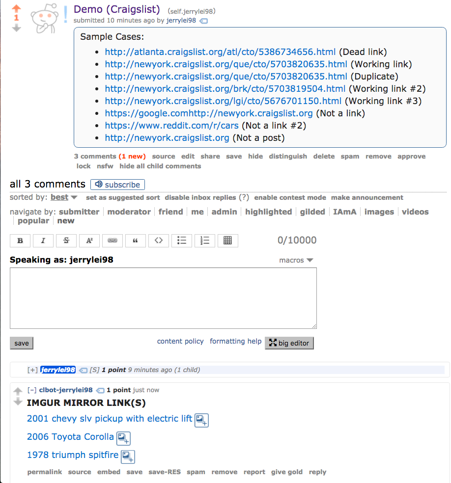
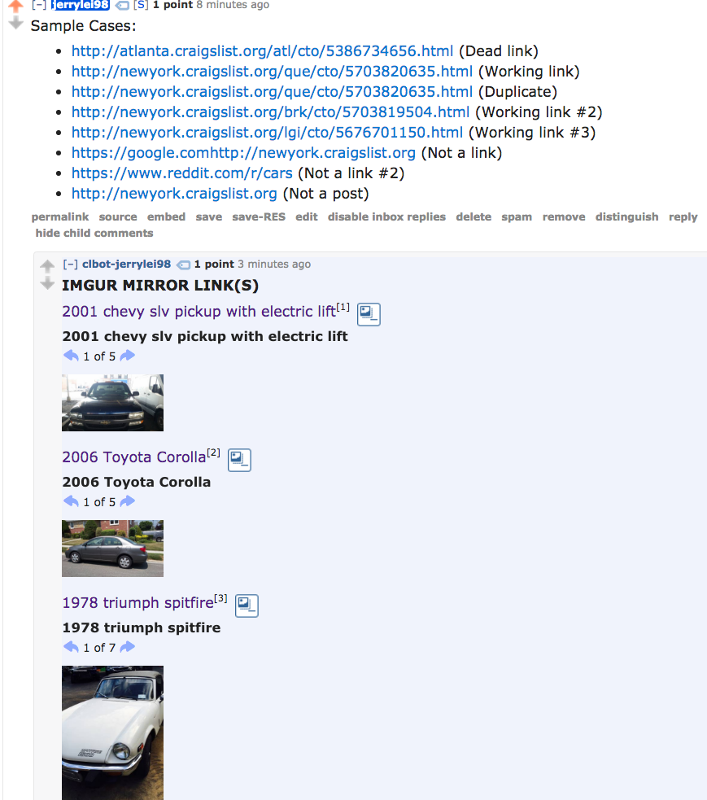

# clbot
Craiglist bot to learn how to implement APIs. Testing on: [/r/jerrylei98](https://reddit.com/r/jerrylei98)

### Self submission example:

### Comment example:

### Goals:

- Pastebin API for text/other data on CL post

### Log

- (July 25) Replies to link submission

- (July 26) Added text reply for comment/submission text -- multiple imgur albums

- (July 27) Probably not going to do anything else. Doing comments/demo images. Upstart script included/sample log added.
